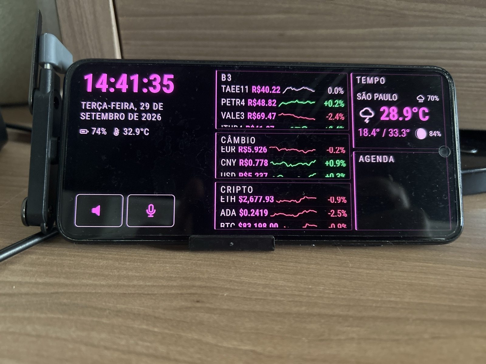

# desk-panel

Turns a spare Android phone into a desk panel for your PC: clock, B3 quotes, crypto, FX and
weather, in a cyberpunk-neon skin — visible **only while the PC is powered on and logged in**.
When the PC shuts down, the phone screen sleeps.

The PC can be Windows, Linux or macOS, and the panel can follow up to three of them: it stays lit
while you are logged in at any one ([ADR 0016](docs/adr/0016-more-than-one-pc.md)). Built for a
Redmi Note 10 (Android 12, MIUI 14) lying in a landscape stand, powered from the PC's USB port.




## Why this exists

USB ports stay energised in S5, so a phone on your desk never learns that the PC went away.
No web API can wake an Android screen, and the one off-the-shelf app that does this well
(Fully Kiosk) is paid and closed source. Glance, Macro Deck, Deckboard, station-dashboard and
IntraHub were all evaluated — none of them blank the display when the host disappears, which
is the entire requirement.

## How it works

```
┌─ Phone ────────────────────────────┐      ┌─ PC: Windows, Linux, macOS ───┐
│  MainActivity (Java)               │      │  server.py (stdlib only)      │
│   ├─ keeps screen on / lets sleep  │      │   ├─ GET /ping                │
│   ├─ PcPoller   ──── http:// ──────┼──────┼─▶ ├─ GET /quotes  → brapi.dev │
│   └─ DataPoller ──── http:// ──────┼──────┼─▶ └─ GET /weather → open-meteo│
│         │ evaluateJavascript       │      │                               │
│         ▼                          │      │  started by the login itself  │
│  WebView — assets from the APK,    │      │  ⇒ only answers while logged  │
│  no network of its own             │      │     in                        │
└────────────────────────────────────┘      └───────────────────────────────┘
```

Three decisions carry the design, and each has an ADR:

- **All network I/O is native.** The WebView is served over `https://` from inside the APK, so
  JavaScript calling a `http://` LAN address would be mixed content. Moving the fetch to Java
  removes the problem instead of working around it. ([ADR 0002](docs/adr/0002-native-owns-network-io.md))
- **The server is both the login signal and the data proxy.** It is started by the graphical
  login and dies with it (a Scheduled Task "At log on" on Windows, a systemd user unit bound to
  the graphical session on Linux, a LaunchAgent limited to the Aqua session on macOS), so it
  only answers while someone is logged in — which is exactly the signal we want
  ([ADR 0010](docs/adr/0010-login-signal-is-session-scoped.md)). Since it exists anyway, routing quotes through it keeps the API token off the phone.
  ([ADR 0004](docs/adr/0004-server-is-login-signal-and-proxy.md))
- **The screen follows the PC, and genuinely sleeps.** Its state is driven by whether the PC
  answers, never by a timeout, and "off" means the display really turns off rather than a
  black render with the backlight lit. ([ADR 0005](docs/adr/0005-real-screen-sleep.md))

The repository states these three as invariants in [CLAUDE.md](CLAUDE.md), because breaking any
one of them silently breaks the design.

## Quickstart

```bash
git clone <this repo> && cd desk-panel

# The panel, with mock data, in any browser. Double-click the file, or:
xdg-open web/index.html        # Linux
open web/index.html            # macOS
start web\index.html           # Windows
```

Opening that file needs **nothing installed** — no Python, no Node, no Docker, no phone. That is
the point, and [docs/RUNNING-LOCALLY.md](docs/RUNNING-LOCALLY.md) takes it from there in three
tiers by what you own. `make check`, the repository's headline command, is the next tier up and
wants Python, Node and Docker.

## Getting started

The Android toolchain runs entirely in Docker — no JDK and no Android SDK on the host
([ADR 0003](docs/adr/0003-containerized-toolchain.md)). See [docs/BUILD.md](docs/BUILD.md).

```bash
make check                                       # every suite that needs no phone
make apk                                         # the debug APK, in the container
python server/server.py                          # the PC half, in the foreground
```

Then install on the phone by browsing to `http://<pc-ip>:8777/app` — no cable, no adb.
[docs/PHONE-SETUP.md](docs/PHONE-SETUP.md) is what Android has to be told;
[docs/INSTALL-PHONE.md](docs/INSTALL-PHONE.md) is where those switches are on the one phone this
was built for.

## Documentation

| Document | What it covers |
|---|---|
| [ARCHITECTURE.md](docs/ARCHITECTURE.md) | The full picture and the three invariants |
| [BUILD.md](docs/BUILD.md) | Containerised toolchain, building, signing |
| [RUNNING-LOCALLY.md](docs/RUNNING-LOCALLY.md) | From `git clone` to something moving, in three tiers by what you own |
| [REQUIREMENTS.md](docs/REQUIREMENTS.md) | The floors, where each is enforced, and the nearly-empty dependency list |
| [PHONE-SETUP.md](docs/PHONE-SETUP.md) | What the panel asks of Android, why, and how to verify each grant |
| [INSTALL-PHONE.md](docs/INSTALL-PHONE.md) | The same switches on the Redmi, under MIUI — one vendor's recipe |
| [CONTRIBUTING.md](CONTRIBUTING.md) | What the project accepts, why the code is laid out this way, and what will send a PR back |
| [SECURITY.md](SECURITY.md) | What to report privately, and what is a design decision rather than a vulnerability |
| [MAINTAINING.md](docs/MAINTAINING.md) | CI, the repository settings as commands, and what a PR needs before merge |
| [SERVER-SETUP.md](docs/SERVER-SETUP.md) | Login-scoped autostart on Windows, Linux and macOS; firewall, static IP, BIOS |
| [UPDATING.md](docs/UPDATING.md) | What to run after a pull, and why a restart is not optional |
| [DEVICE-CARE.md](docs/DEVICE-CARE.md) | Battery, heat and burn-in — and the honest limits |
| [TESTING.md](docs/TESTING.md) | Five test layers, and which of them install anything |
| [LOCAL-MODELS.md](docs/LOCAL-MODELS.md) | Driving the repo with a local model instead of Opus — which one, and its limits |
| [adr/](docs/adr/) | Decision records, including the options that were rejected |

Work is tracked as self-contained task files under [tasks/](tasks/), indexed by
[tasks/STATUS.md](tasks/STATUS.md).

## Status

Running on the desk it was built for. The panel, the screen following the PC and the two mute
buttons work on the target phone; the server has run against it from Linux, Windows and macOS,
and on Linux it starts by itself at every login. **On Windows, starting by itself at login failed
once and has not been diagnosed yet** (T3.8). Most other open rows in
[tasks/STATUS.md](tasks/STATUS.md) wait on hardware or a human step, such as a reboot test on the
phone or a logout watched from a second machine. That file is the index, and it says plainly
what has only ever run on one phone.

**Tried it on another phone?** That is the most useful thing you can send back, whether it worked
or not. Open an issue and pick the **Device report** form ([its questions](.github/ISSUE_TEMPLATE/device-report.yml));
[CONTRIBUTING.md](CONTRIBUTING.md) says what else the project accepts, and
[SECURITY.md](SECURITY.md) how to report anything private.

## License

MIT
